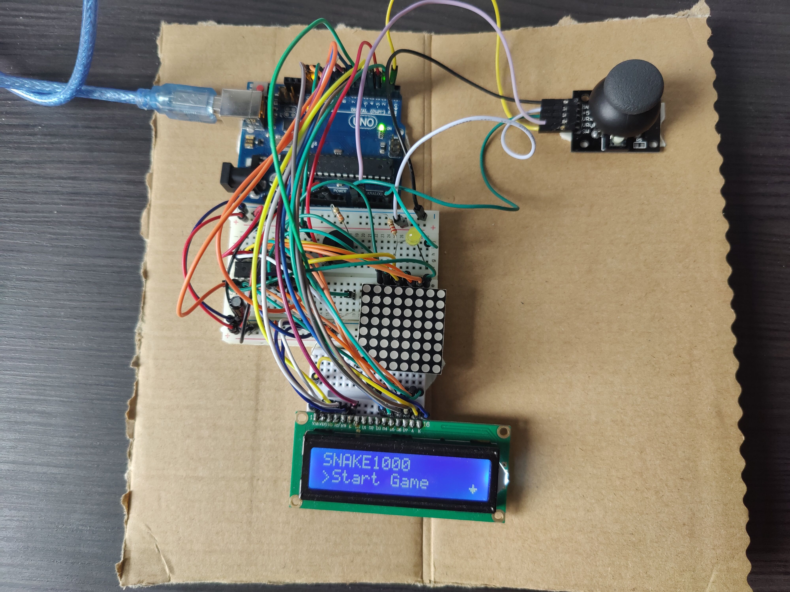

# SNAKE1000
## Backstory 
I wanted to have fun building a game and due to the restrictions of an 8x8 matrix, I tought snake would be a great choice. The problem with snake is that it's becoming boring pretty fast, so I managed to do some "twists" to it, which increase the enjoyment of the game. 🐍         
*(Also, I was obsessed with snake when I played it for the first time on my father's nokia).* 

## Game description
It's pretty straight forward. You are controlling a snake and need to eat the blinking food without touching the wall or eating yourself.

Here comes 4 levels of difficulty:
- <b>Difficulty 1</b> - nothing added, everything is classic.
- <b>Difficulty 2</b> - food has a <b>45% chance</b> of being poisoned. You can see that by the on/off yellow led💡. If you eat poisoned food, the snake is being reversed (head and tail swapped). 

*Keep an eye on the tail*😅.

- <b>Difficulty 3</b> - walls are dynamically generated on the map and you should avoid them.

- <b>Difficulty 4</b> - food can be poisoned, walls as obstacles and your snake is dizzy 💫 (your controls are reversed: RIGHT <-> LEFT and UP <-> DOWN). 

*You should be very trained for that.*

## How to play 🎮
- Make your personal settings
- Enter your name
- Select the difficulty
- Beat the highscores

## Used Components 🕹️
* Matrix (8x8)
* LCD display (16x2)
* Joystick
* Yellow Led
* Buzzer
* Resistors and wires (per logic)

You can check the project requirements <a href="https://github.com/RobertLita/SNAKE1000/blob/main/Matrix project requirements.pdf">here.</a>

 

  <h3>
    <a href="https://youtu.be/FClM7hj5NJU">
      ▶️ Click here for video
    </a>
  </h3>

*[Other repo](https://github.com/RobertLita/IntroductionToRobotics) with robotics homework*.
